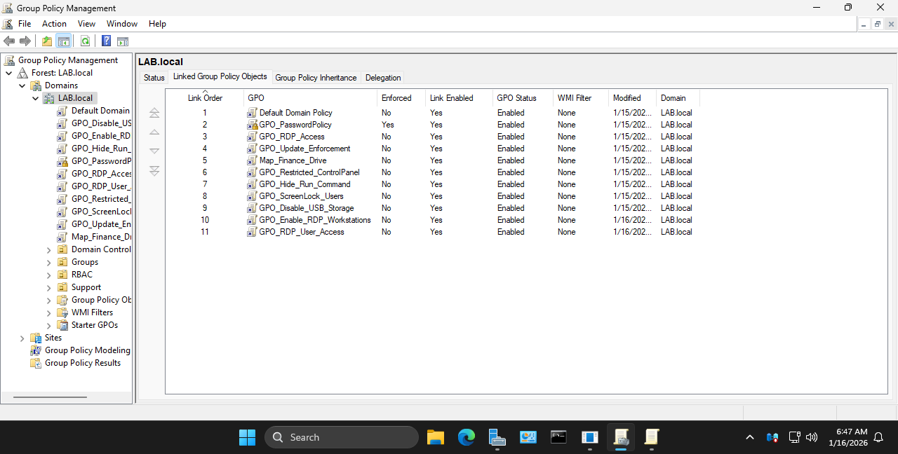
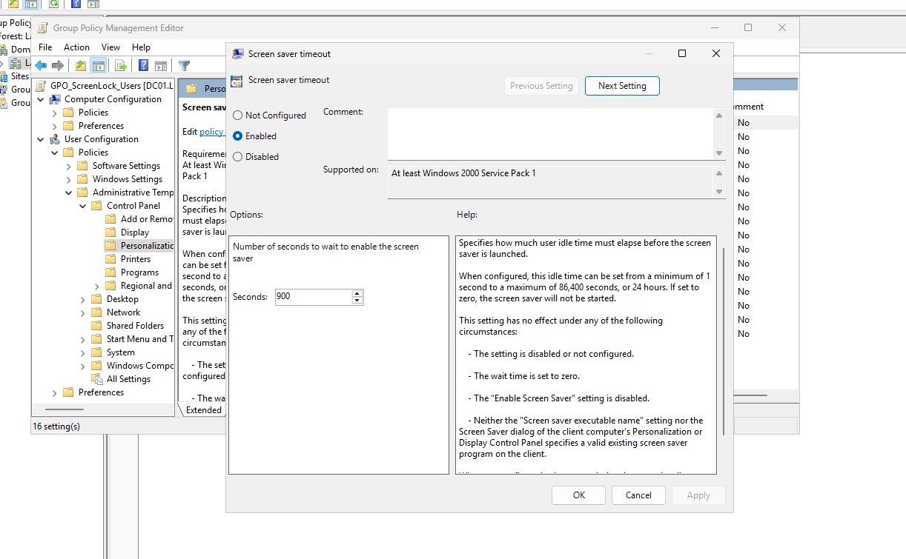
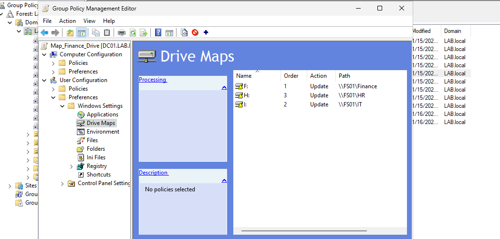

# Group Policy Strategy

## Overview
Group Policy is used to enforce security settings, standardize workstation behavior, and control access across the domain.

## GPO Design Approach
Group Policy Objects are organized by function rather than grouped into a single large policy. This approach improves visibility, reduces unintended side effects, and simplifies troubleshooting.

- Each GPO has a single, clearly defined purpose  
- Policies are scoped to Organizational Units rather than applied domain-wide  
- Default Domain Policy is reserved exclusively for authentication-related settings.
  

## Workstation Security Example
Baseline workstation security settings are applied to enforce consistent user behavior and reduce risk.

This includes policies such as screen lock enforcement, Control Panel restrictions, and system configuration hardening. These settings help prevent accidental misconfiguration while maintaining usability for end users.

## Drive Mapping Example
Network drive access is delivered using Group Policy Preferences and scoped by department. Drives are mapped automatically at user logon based on Organizational Unit placement.

- Drive mappings reference file shares hosted on the dedicated file server  
- Access is controlled through NTFS permissions assigned to security groups  
- No manual drive mapping is performed on individual machines
  

## Remote Desktop Access Control
Remote Desktop access is controlled using User Rights Assignment through Group Policy to enforce least privilege.

- Support users are permitted to access workstations only  
- Server access is restricted to IT administrators  
- Explicit deny policies prevent unauthorized RDP access 

## Policy Enforcement and Scope
All policies are linked at the Organizational Unit level to ensure predictable behavior and avoid unintended inheritance. GPO enforcement is used sparingly and only when necessary.

This design allows policies to be modified or extended without impacting unrelated users or systems.
