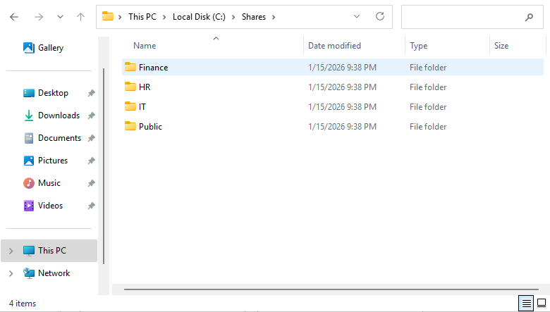
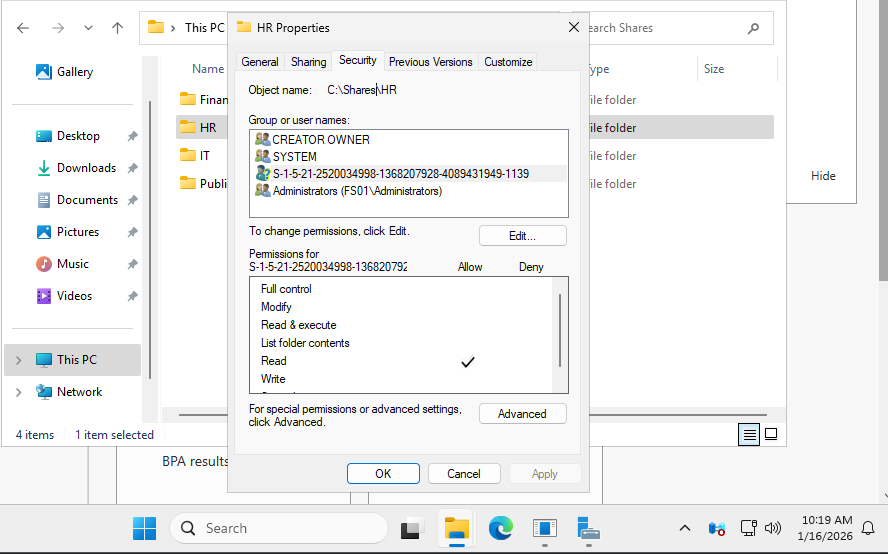

# File Server Configuration

## Overview
A dedicated file server provides centralized file storage for the domain. Access to data is controlled using NTFS permissions assigned to Active Directory security groups following a role-based access control model.

## Folder Structure
Departmental folders are organized under a single shared root directory to simplify management and permissions.

- Each department has a dedicated folder
- The shared root directory is not exposed directly to users
  
## Permissions Model
Access to file shares is controlled using NTFS permissions assigned to Active Directory security groups.

- Permissions are assigned to groups, not individual users
- Each department group has access only to its own data
- IT administrators retain full access for management and recovery

## Share Configuration
Folders are shared using standard SMB shares. Share permissions are kept permissive and access control is enforced at the NTFS level.

- Share permissions allow broad access
- NTFS permissions provide the primary security boundary
  
## Access Delivery
Network drives are mapped automatically using Group Policy Preferences based on Organizational Unit placement.

- Users receive access to department drives at logon
- Drive visibility and access are controlled by group membership
- No manual drive mapping is required
