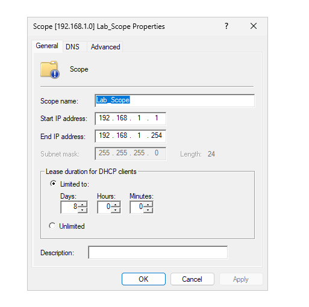

# Networking Overview

## Overview
The lab uses a single internal network to support domain services, workstation connectivity, and remote support operations. Networking is designed to be simple, reliable, and aligned with Active Directory best practices.

## Network Topology
- All systems are connected to a single internal virtual network
- The domain controller acts as the central point for authentication and name resolution
- No external-facing services are exposed

## IP Addressing Strategy
- Servers use static IP addresses to ensure consistent service availability
- Workstations receive IP addresses dynamically via DHCP
- All domain-joined systems use the domain controller for DNS resolution

## DNS Services
- DNS is hosted on the domain controller
- Active Directory–integrated DNS zones are used
- DNS supports domain authentication, file share access, and Remote Desktop connectivity

## DHCP Services
- DHCP is centrally managed on the domain controller
- A defined scope provides IP addresses to workstations
- DHCP options assign the correct DNS server and domain name automatically
  

## Operational Considerations
- Incorrect DNS configuration is the primary cause of domain connectivity issues
- Centralized network services simplify troubleshooting and administration
- Network design supports secure remote support and file access workflows
