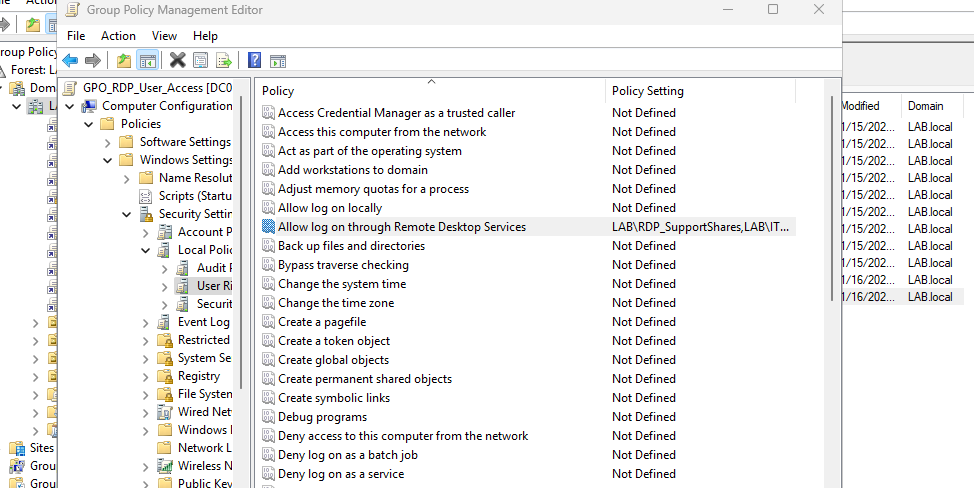
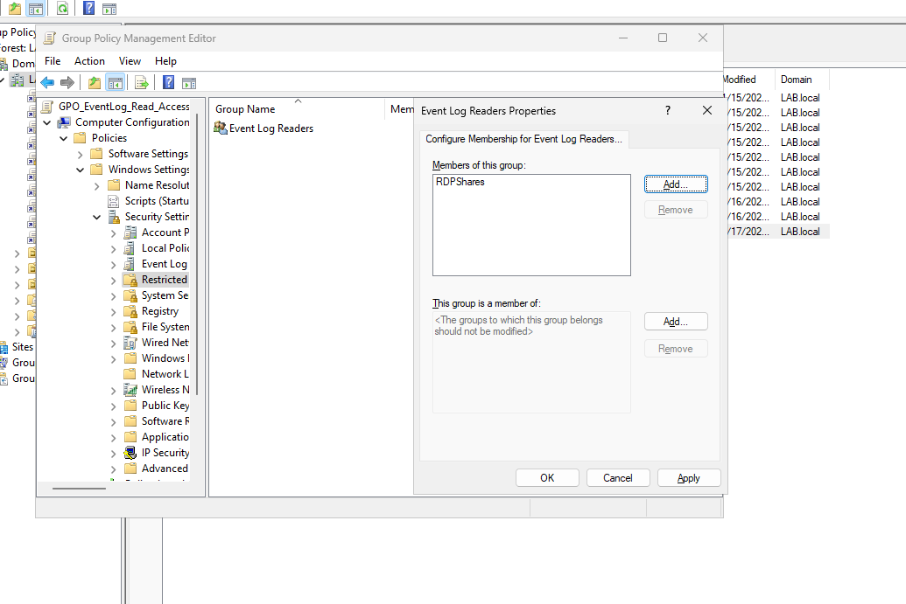

# Remote Support Workflow

## Overview
The lab includes a remote desktop support workflow designed to mirror real-world desktop support operations. Support access is intentionally limited to allow effective troubleshooting while maintaining least-privilege security controls.

## Remote Desktop Access
Remote Desktop access is centrally managed using Group Policy.

- Remote Desktop is enabled on domain-joined workstations via Group Policy
- Support users are permitted to access workstations only
- Server access is restricted to IT administrators
  
## Support User Capabilities
Support users can remotely connect to workstations to diagnose and resolve common user issues without requiring administrative privileges.

Typical support tasks include:
- Investigating login and authentication issues
- Troubleshooting network connectivity problems
- Verifying drive mapping and file access
- Reviewing application and system errors
  
## Delegated Troubleshooting Access
Support users are granted read-only access to Event Viewer logs to assist with troubleshooting.

- Access is delegated using the built-in Event Log Readers group
- Support users are not local administrators
- Administrative privileges remain restricted to IT roles
  
## Operational Flow
1. A user reports an issue with access or system behavior
2. A support user connects to the workstation using Remote Desktop
3. Logs are reviewed using Event Viewer to identify errors
4. Configuration or access issues are resolved using delegated permissions or centralized policy changes
5. Changes are applied centrally through Active Directory or Group Policy when required
