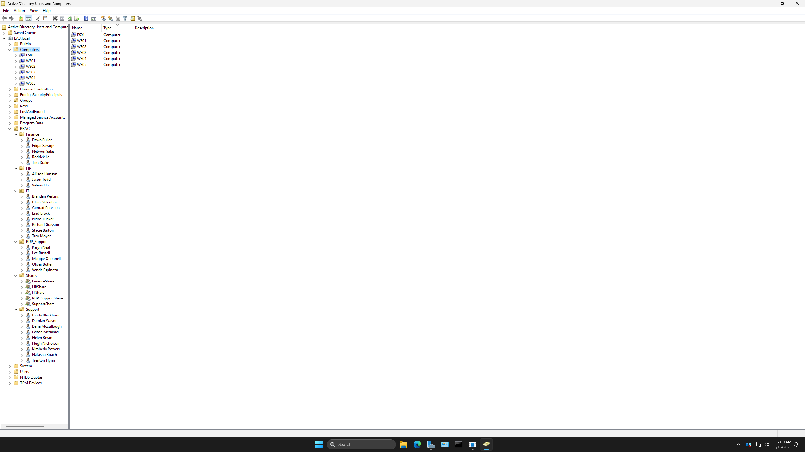

# Active Directory Design

## Overview
This document outlines the Active Directory design used in the lab, including Organizational Units, users, and role-based security groups.

## OU Structure
- Department-based OUs are used for users
- Separate OUs exist for workstations and servers
- OU design allows targeted Group Policy application

The screenshot above shows the Organizational Unit structure used to separate users, workstations, and servers for policy scoping.

## Security Groups
- Security groups represent job roles
- Permissions are assigned to groups, not individual users
- Group membership determines access to file shares, Remote Desktop, and system permissions
